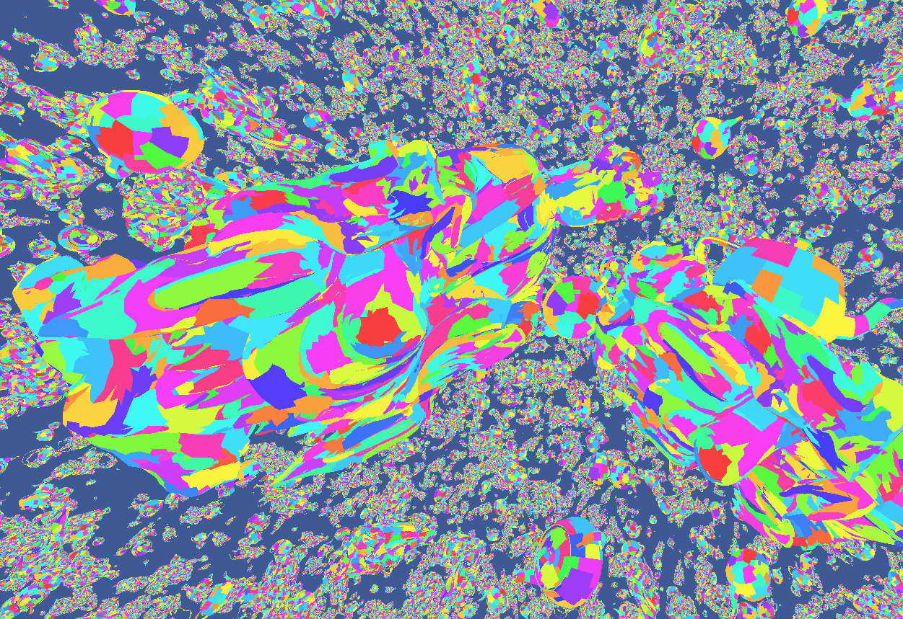

# Twilight Engine

An experimental Vulkan-based rendering engine focused on implementing and learning modern GPU-driven rendering techniques. This project serves as an educational platform for exploring advanced graphics programming concepts and optimization techniques.



*Visualization of meshlets with different colors showing individual meshlet boundaries*

## Key Features & Learning Areas

### Advanced Mesh Processing
- **Mesh Shading Pipeline**: Implementation of the modern mesh shader pipeline (Task + Mesh shaders) replacing traditional vertex/geometry processing
- **Meshlet Generation**: Meshlet building and optimization using meshoptimizer
  - Configurable meshlet sizes (currently max 64 vertices, 124 triangles)
  - Cone-based culling for meshlet-level visibility testing
  - Automatic LOD generation for meshlets


*Visualization showing different culling techniques in action*

### Multi-Level Culling System
- **Frustum Culling**: GPU-driven view frustum culling
- **Occlusion Culling**: Hierarchical depth buffer optimization
  - Hi-Z buffer generation and management
  - GPU-driven occlusion testing
- **Meshlet Backface Culling**: Cone-based culling at the meshlet level

### GPU-Driven Architecture
- **Multi-Draw Indirect**: Efficient GPU-driven draw call generation
- **Double-buffered Visibility**: Smart visibility state management between frames
- **Compute Shader Culling**: Two-phase culling system
  - Early cull pass for previously visible objects
  - Late cull pass with occlusion/visibility testing
- **Shader-based LOD Selection**: Dynamic LOD selection driven by GPU
- **Reverse Z-Buffer**: Improved depth precision using reverse Z technique

## Technical Implementation Notes

### Culling Pipeline
```
Frame N:
1. Early Cull: Process previously visible objects
    - Frustum test
2. Early Draw: Render objects that passed early cull
    - Meshlet cone culling
3. Hi-Z Construction: Build depth pyramid
4. Late Cull: Process previously occluded objects
   - Frustum test
   - Occlusion test using Hi-Z
5. Late Draw: Render newly visible objects
   - Meshlet cone culling
```

### Current Status & Limitations
- Educational/experimental project, not production-ready
- Work in progress implementation of various techniques
- Currently focused on static mesh rendering
- Limited to Windows/Vulkan platform

## Building & Running

### Build Instructions
```bash
mkdir build
cd build
cmake ..
cmake --build .
```

### Controls
- **WASD**: Camera movement
- **Right Mouse**: Camera rotation
- **C**: Toggle frustum culling
- **O**: Toggle occlusion culling
- **F**: Freeze frustum culling (debug)
- **P**: Freeze occlusion buffer (debug)
- **L**: Toggle LOD system
- **Space**: Reset camera position

## Performance Considerations

The engine implements several optimization techniques:
- GPU-driven culling to minimize CPU overhead
- Double-buffered visibility determination
- Efficient meshlet generation and culling
- Hi-Z buffer for accelerated occlusion testing

## TODO:
- [x] Mesh Shader
- [x] Amplification/Task Shader
- [x] Multi-Draw Indirect (draw command generation from compute shader)
- [x] Reverse Z (reverse float depth for better precision)
- [x] Meshlet Cone Culling
- [x] GPU frustum culling
- [x] GPU occlusion culling
	- [ ] Fix minor popping
	- [x] Freeze camera/depth to view occlusion results
- [x] Dynamic Descriptor Layout (parse slang json)
- [ ] Dynamic object support
- [ ] Static vs Dynamic instances
- [ ] GPU Triangle culling
- [ ] GPU Meshlet culling
- [ ] Scene Loading
- [ ] Ray tracing integration
- [ ] Clustered rendering
- [ ] Material system
    - [ ] Image Compression
---

**Note**: This project is primarily for educational purposes and learning graphics programming concepts. It serves as a testbed for implementing and understanding modern rendering techniques.
